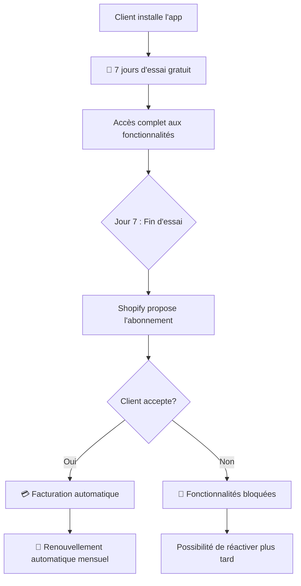

# 🎁 Système de Facturation Automatique - 7 Jours d'Essai Gratuit

## 📋 Vue d'ensemble

Votre application "Announcement Bar App" est maintenant configurée avec un système de facturation automatique géré par Shopify qui offre **7 jours d'essai gratuit** à tous les nouveaux utilisateurs.

## 🔄 Comment ça fonctionne

### 1. Installation de l'app
- ✅ Le client installe votre app depuis l'App Store Shopify
- 🎁 **7 jours d'essai gratuit** commencent automatiquement
- 🚀 Accès immédiat à toutes les fonctionnalités premium

### 2. Période d'essai (Jours 1-7)
- 🎯 L'utilisateur peut utiliser toutes les fonctionnalités premium
- 📊 Pas de limitations
- 💳 **Aucune facturation pendant cette période**
- 🔔 Notifications automatiques du temps restant

### 3. Fin de l'essai (Jour 7)
- 🤖 **Shopify gère automatiquement** la transition
- 💳 Facturation automatique si l'utilisateur accepte de continuer
- 🚫 Blocage des fonctionnalités premium si refus de payer
- 📧 Notifications automatiques par Shopify

### 4. Gestion continue
- 💰 Facturation mensuelle/annuelle gérée par Shopify
- 🔄 Renouvellements automatiques
- 📊 Rapports de facturation dans votre dashboard Shopify Partner

## 🛠️ Configuration Technique

### Paramètres de facturation
```javascript
billing: {
  "Premium Monthly": {
    amount: 4.99,
    currencyCode: "USD",
    interval: "EVERY_30_DAYS",
    trialDays: 7, // 7 jours d'essai gratuit
  },
  "Premium Annual": {
    amount: 39.99,
    currencyCode: "USD", 
    interval: "ANNUAL",
    trialDays: 7, // 7 jours d'essai gratuit
  },
}
```

### Middleware de vérification automatique
- ✅ `checkBillingStatus()` - Vérifie le statut en temps réel
- 🔒 `requireActiveBilling()` - Protège les routes premium
- 💳 `createShopifySubscription()` - Crée les abonnements avec essai

## 🎯 Avantages du système

### Pour vos clients :
- 🎁 **7 jours gratuits** pour tester sans engagement
- 💳 **Gestion automatique** par Shopify (sécurisé et fiable)
- 🔄 **Pas de gestion manuelle** des paiements
- 📧 **Notifications automatiques** pour les renouvellements

### Pour vous :
- 🤖 **Gestion entièrement automatisée** par Shopify
- 💰 **Paiements garantis** et sécurisés
- 📊 **Rapports de revenus** intégrés
- 🚫 **Pas de gestion des impayés** - Shopify s'en charge
- 🔄 **Renouvellements automatiques**

## 📊 Flow de l'expérience utilisateur



## 🔔 Messages d'état

Votre dashboard affiche automatiquement :

- **En essai** : `🎁 Essai Gratuit: X jour(s) restant(s) - Shopify activera automatiquement la facturation après 7 jours`
- **Actif** : `✅ Plan Premium Actif - Shopify gère automatiquement votre facturation`  
- **Expiré** : `⏰ Essai gratuit expiré - Shopify gère automatiquement vos paiements`

## 🚀 Mise en production

1. **Testez d'abord** avec `test: true` en développement
2. **Passez en production** avec `test: false` 
3. **Shopify gère tout** automatiquement dès la publication

## 💡 Notes importantes

- ✅ **Shopify App Store** se charge de toute la facturation
- 💳 **Paiements sécurisés** via Shopify Payments
- 🌍 **Support multi-devises** automatique
- 📊 **Analytics de revenus** dans votre Partner Dashboard
- 🔄 **Gestion des remboursements** par Shopify
- 📧 **Notifications clients** automatiques

Votre app est maintenant prête pour offrir une expérience d'essai gratuit de 7 jours avec gestion automatique de la facturation par Shopify ! 🎉

